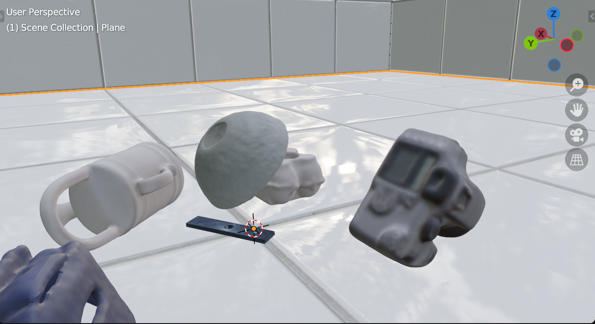

# 6D Synthetic Pose Dataset with BlenderProc2

## Blenderproc2 documentation:

https://dlr-rm.github.io/BlenderProc/#tutorials

A procedural Blender pipeline for photorealistic rendering.

[Documentation](https://dlr-rm.github.io/BlenderProc) | [Tutorials](#tutorials) | [Examples](#examples) | [ArXiv paper](https://arxiv.org/abs/1911.01911) | [Workshop paper](https://sim2real.github.io/assets/papers/2020/denninger.pdf) | [JOSS article](https://joss.theoj.org/papers/10.21105/joss.04901)
